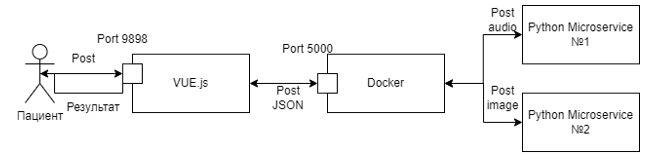

## Разработка диалогового агента для автоматизированного контроля состояния пациентов и взаимодействия с медицинским персоналом на основе технологий обработки мультимодальных слабоструктурированных данных

Актуальность разработки системы заключается в необходимости автоматизации контроля состояния пациента для сокращения временных затрат на сбор и анализ показателей, а также для повышения доступности медицинских услуг маломобильным пациентам. Автоматизация этого процесса позволит увеличить пропускную способность медицинских учреждений и улучшить качество обслуживания пациентов, обеспечивая более эффективное и своевременное медицинское наблюдение.

Объектом исследования является процесс контроля за состоянием пациента и его взаимодействия с медицинским персоналом.

Предметом являются методы и алгоритмы автоматизации контроля за состоянием пациента и его взаимодействия с медицинским персоналом.

Цель выпускной квалификационной работы — разработка информационного и программного обеспечения диалогового агента персонализированного взаимодействия врача и пациента на основе технологий обработки мультимодальных слабоструктурированных данных.

### Задачи
Для достижения цели поставлены следующие задачи:
1. Анализ процесса удаленного наблюдения за состоянием пациента и взаимодействия между пациентом и медицинским персоналом;
2. Анализ существующих подходов к контролю состояния пациента;
3. Разработка модели пациента;
4. Разработка алгоритма автоматизированного наблюдения за состоянием пациента;
5. Разработка алгоритма мультимодальных слабоструктурированных данных;
6. Разработка программного обеспечения диалогового агента;
7. Разработка распределенной серверной архитектуры диалогового агента;
8. Настройка и конфигурация микросервиса диалогового агента на сервере;
9. Внедрение диалогового агента в процесс взаимодействия пациента с врачом.

## Анализ процесса удаленного наблюдения
Чтобы наглядно продемонстрировать данную проблему была разработана модель AS-IS, то есть как это есть сейчас.

## Распознавание речи в медицине
Технология преобразования речи в текст основана на алгоритмах машинного обучения и нейронных сетях. Основные этапы включают в себя сбор информации, фильтрацию шумов и разделение аудиодорожек, преобразование звуковых волн в цифровые сигналы, которые анализируются по частоте и амплитуде, финальное распознавание цифровых сигналов в текст.
В настоящее время выделяют три основные языковые модели:
– статистические n-граммные модели;
– рекуррентные нейронные сети;
– конволюционные нейронные сети.

## Компьютерное зрение в медицине
В медицине компьютерное зрение используется для решения ряда важных задач:
– анализ медицинских изображений, таких как рентгеновские снимки, МРТ, КТ, и ультразвуковые изображения, позволяет выявлять патологические изменения, такие как опухоли, повреждения тканей и другие аномалии;
– компьютерное зрение помогает хирургам в реальном времени следить за положением инструментов и анатомических структур, улучшая точность и безопасность операций;
– видеонаблюдение с использованием компьютерного зрения может отслеживать состояние пациентов в реанимации и других отделениях, выявляя критические изменения в состоянии здоровья;
– автоматический анализ микроскопических изображений тканей позволяет ускорить процесс диагностики и повысить его точность.
Компьютерное зрение в медицине использует различные технологии и модели глубокого обучения, в том числе сверточные нейронные сети (CNN), которые особенно эффективны для обработки изображений. Одним из популярных подходов является использование моделей распознавания объектов, таких как YOLO (You Only Look Once).

## Разработка модели автоматизированного наблюдения за состоянием пациента
Для создания автоматизированной системы необходимо выполнить разработку модели TO-BE. В этой модели исключается связывающее звено между врачом и пациентом – регистратора, что сказывается в положительную стороны во времени взаимодействия, вероятности отказа системы, а также сокращает траты лишних человеко-часов.

Когда необходимо снять показания, система самостоятельно оповестит об этом пациента уведомлением. Далее человек снимает показатели и выбирает удобный ему вариант ввода: ручной, голосовой или ввод с помощью изображения. После окончания ввода данные передаются системе для обработки. Если был выполнен ручной ввод, то показатели сразу анализируются и, в зависимости от оценки, произведенной по модели пациента, выносится решение об уведомлении врача.

## Разработка модели пациента
Модель пациента включает в себя информацию о нем, отражает его личные специфики организма. Разработана модель пациента C включает в себя множества организационных характеристик и множество жизненных показателей:

C={C_m,C_l,A }, (1)

где C_m в (1) - организационные характеристики, C_l - жизненные показатели, A – интегральная оценка пациента.

В подномножество C_m входят имя, дата рождения, пол (2).

C_m={N,D,S}, (2)

где N в (2) - имя, D - дата рождения, S - человека. В подмножество жизненных показателей входят пульс, артериальное давление, вес, рост, уровень глюкозы и температура (3)

C_l={P,AP,W,H,G,T}, (3) где P в (3) - показатель пульса, AP - показатель артериального давления, W - показатель веса, H - показатель роста, G - показатель глюкозы, T - показатель температуры.

Расчет интегральной оценки осуществляется на основе референсных значений отдельных жизненных показателей. На данный момент в нее входят: индекс массы тела, артериальное давление, пульс, уровень глюкозы. Уровень показаний будет оценен по трех-бальной шкале, где:
* 3 - норма;
* 2 - в пределах нормы;
* 1 - критический показатель.

A=(C_давление+C_(и.м.т)+C_пульс+C_глюкоза )/Q_(кол-во показателей ) , (4)

Исходя из (4) мы получаем интегральную оценку пациента, которая позволяет выполнять расчет уровня состояния пациента.

Для оценки артериального давления использовались данные 2018 года, опубликованные после конференции европейского кардиологического сообщества в Мюнхене.

Оценка пульса была выполнена на основании ВОЗ

Для оценки массы тела используется индекс, который рассчитывается по формуле

I=m∕h^2, (3)

где m в (3) — масса тела (кг); h — рост (м).

В таблице приведена оценка индекса массы тела в соответствии с рекомендациями ВОЗ

Для оценки содержания уровня сахара в крови были использована данные ВОЗ

## Разработка алгоритма автоматизированного наблюдения за состоянием пациента

## Разработка алгоритма обработки мультимодальных слабоструктурированных данных

Ранее после внесения показателей они сразу же отправлялись врачу вне зависимости от того, в норме они или нет. Сейчас же между пациентом и врачом будет находится агент, который будет решать следует ли уведомить врача о показателях пациента или нет. В случае, если после расчета по модели пациента, показатель находятся в норме, то агент не будет уведомлять об этом специалиста, в ином случае отправит уведомление исходя из его значения.

## Микросервисная архитектура
Microservice architecture - микросервисная архитектура является развитием идей SOA, при котором приложение делится на небольшие, независимые компоненты - микросервисы, каждый из которых выполняет свою задачу и взаимодействует с другими через определенные интерфейсы. Данная архитектура показана на рисунке.

## Результаты
Для реализации функционала записи голоса в приложение были разработаны соответствующие экраны пользователя, добавлены элементы для начала записи голоса и выгрузки изображений

После этого происходит переход на страницу с записью голоса и экран сохранения данных.

На рисунке изображены логи Docker, на которых виден результат распознавания голоса и вычленение чисел

На рисунке продемонстрирован экран ввода с использованием изображения. После распознавания чисел происходит переход на экран сохранения результата.

Согласно приказу Министерства здравоохранения РФ от 2 июня 2015 года №290н, на прием одного пациента отводится 15 минут, это значит, что врач может принимать от 96 до 144 пациентов в неделю, в среднем 120 человек. При использовании системы данное количество увеличилось до 177.

## Заключение
В данной работе выполнен анализ процесса удаленного взаимодействия пациента с медицинским персоналом. Разработана диаграмма AS-IS отображающая критические точки системы, которые нуждаются в улучшении. Произведен анализ существующих подходов к состоянию пациента, а именно телемедицина, мобильные приложения и умные устройства. Приведены результаты тестирования систем удаленного мониторинга на территории Российской Федерации и за её пределами. Подобрана языковая модель для распознавания речи пациента. Выполнено сравнение моделей для распознавания изображений. Произведен анализ существующих систем по удаленному контролю здоровья. Разработана модель TO-BE, решающая недостатки модели AS-IS. Модель стала менее предрасположенной к отказам в связи с исключением из нее регистратора. Добавлен ввод показателей используя речь и изображения. Составлена модель пациента и выведена его интегральная оценка здоровья для дальнейшего использования его моделью. В систему был добавлен анализ показателей и уведомления о них врача, в зависимости от показателя. Разработаны алгоритмы распознавания мультимодальных данных, напоминания пациенту о времени внесения показателей, уведомления врача. Спроектирована архитектура развертывания системы. Она включает в себя модуль основного сервера, устройства пользователя, сервера с базой данных и двух микросервисов для распознавания данных. Выполнена общая характеристика технологий, которые используются для реализации системы. Построена микросервисная архитектура, показывающая физическое взаимодействие с ее компонентами. Разработано программное обеспечение для диалогового агента, а именно микросервис для распознавания голоса и изображений. Выполнено тестирование на локальной машине. Выполнена настройка и конфигурация микросервиса на сервере, после чего было проведено тестирование на Docker контейнере, развернутого на машине и на удаленном контейнере. Разработаны формы окон приложения для пациента, добавлены модули для ввода голоса и изображение. Выполнена автоматическая оценка показателей пациента на основе его модели.